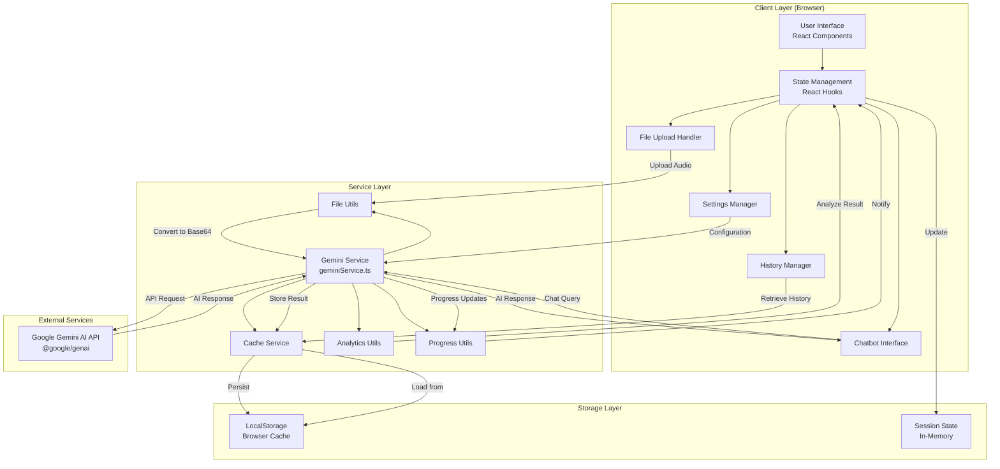
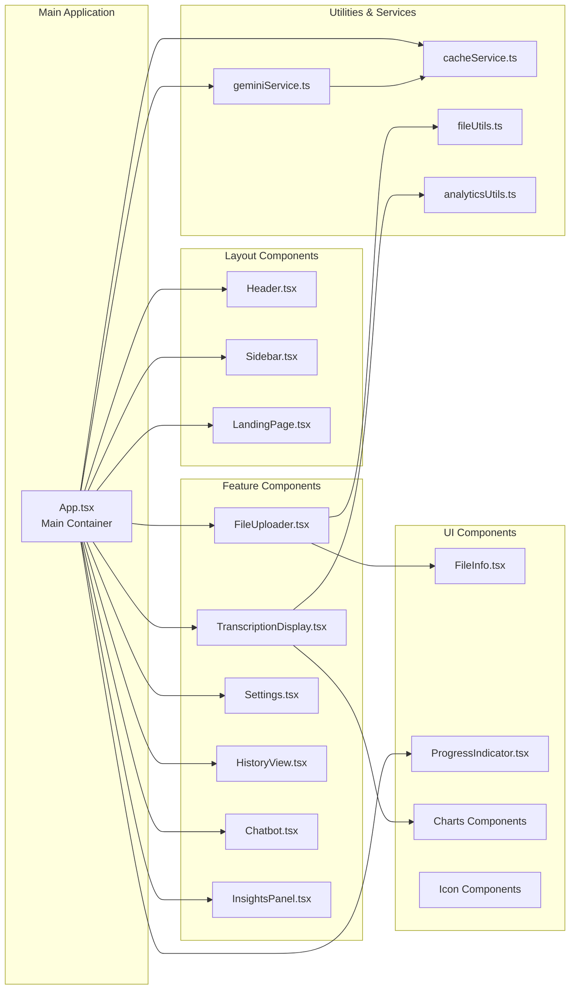
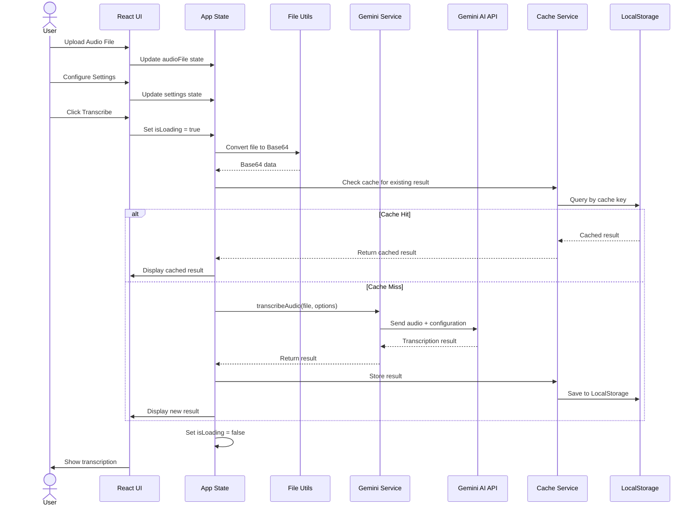

# Architecture Documentation

## Overview

**Transcripted** is an AI-powered audio transcription web application that converts audio files into accurate, speaker-separated text with intelligent analysis capabilities including summarization, sentiment analysis, and entity extraction.

---

## Technology Stack

### Frontend

- **Framework**: React 19.2.3
- **Language**: TypeScript 5.8.2
- **Build Tool**: Vite 6.2.0
- **Styling**: Tailwind CSS (via CDN)
- **UI Components**: Custom React components
- **Fonts**: Google Fonts (Inter, Poppins)
- **State Management**: React Hooks (useState, useCallback)
- **Module System**: ESNext with ES2022 target

### Backend / AI Services

- **AI Provider**: Google Gemini AI
- **AI SDK**: @google/genai v1.33.0
- **API Integration**: RESTful API calls to Gemini AI
- **Audio Processing**: Browser-native Audio API for metadata extraction
- **File Processing**: Base64 encoding for file transmission

### Database / Storage

- **Primary Storage**: Browser LocalStorage
- **Caching Layer**: Custom cache service (cacheService.ts)
- **Data Persistence**: Client-side caching for transcription history
- **Session Management**: In-memory state management via React

### Development Tools

- **Package Manager**: npm
- **Module Bundler**: Vite with React plugin (@vitejs/plugin-react)
- **Type System**: TypeScript with experimental decorators
- **Module Resolution**: Bundler resolution strategy
- **Path Aliases**: `@/*` mapped to project root

---

## High-Level System Architecture

### Component Architecture

### Data Flow Architecture

---

## Core Features & Architecture

### 1. Audio Transcription
- **Input**: Audio files (MP3, WAV, M4A, etc.)
- **Processing**: Google Gemini AI with structured output schema
- **Output**: Timestamped, speaker-labeled transcription segments

### 2. Speaker Diarization
- **Feature**: Automatic speaker identification and labeling
- **Configuration**: Toggle-able via settings
- **Implementation**: Gemini AI native diarization capabilities

### 3. AI Summarization
- **Options**: Configurable length (Short, Medium, Long)
- **Detail Levels**: Concise, Balanced, Detailed
- **Formats**: Bullets, Paragraphs, Structured
- **Implementation**: Gemini AI text generation

### 4. Sentiment Analysis
- **Overall Sentiment**: Global emotional tone analysis
- **Trend Analysis**: Chronological sentiment progression
- **Visualization**: Charts and graphs via custom chart components

### 5. Entity Extraction
- **Categories**: People, Organizations, Locations, Dates, Topics
- **Implementation**: Gemini AI entity recognition
- **Display**: Categorized entity lists in insights panel

### 6. Search Grounding
- **Feature**: Optional web search integration for context
- **Implementation**: Gemini AI search grounding capabilities

### 7. Chatbot Interface
- **Purpose**: Interactive Q&A about transcription content
- **Context**: Maintains transcription context for queries
- **Implementation**: Gemini AI conversational model

### 8. History Management
- **Storage**: LocalStorage-based caching
- **Key Generation**: Hash-based cache keys from file + options
- **Retrieval**: Fast lookup by cache key
- **Display**: Historical transcriptions in dedicated view

---

## Security Considerations

### API Key Management
- **Storage**: Environment variables (.env.local)
- **Build-time Injection**: Vite configuration defines process.env variables
- **Client Protection**: API key exposed in client (note: consider backend proxy for production)

### File Handling
- **Validation**: File type and size validation before processing
- **Processing**: Client-side Base64 encoding
- **Transmission**: Direct to Gemini AI API

### Data Privacy
- **Local Storage**: All history stored client-side
- **No Backend**: No server-side data persistence
- **User Control**: User can clear cache/history

---

## Performance Optimizations

### Caching Strategy
- **Cache Key**: Generated from file metadata + transcription options
- **Hit Rate**: Prevents duplicate API calls for same file/settings
- **Storage**: Browser LocalStorage with size limitations

### Progress Indication
- **Simulated Progress**: Multi-stage progress updates during transcription
- **User Feedback**: Real-time progress bar with stage descriptions
- **UX Enhancement**: Keeps users informed during long operations

### Code Splitting
- **Module Loading**: ES modules with dynamic imports
- **Bundle Optimization**: Vite build optimization
- **Asset Loading**: Lazy loading where applicable

---

## Deployment Architecture

### Development Environment
- **Dev Server**: Vite dev server on port 3000
- **Host**: 0.0.0.0 (accessible on network)
- **Hot Reload**: Automatic on file changes

### Production Build
- **Build Command**: `npm run build`
- **Output**: Optimized static assets
- **Hosting**: Static file hosting (Vercel, Netlify, GitHub Pages compatible)
- **Preview**: `npm run preview` for production build testing

### Environment Configuration
- **API Keys**: .env.local file (not committed to repo)
- **Build Variables**: Injected at build time via Vite
- **Runtime**: Client-side environment variable access

---

## Future Architecture Considerations

### Scalability
- **Backend API**: Consider implementing backend proxy for API key security
- **Database**: Consider server-side database for cross-device history sync
- **File Storage**: Consider cloud storage for large audio files

### Enhanced Features
- **Real-time Transcription**: WebSocket integration for live audio
- **Multi-language Support**: Enhanced language detection and UI i18n
- **Collaboration**: Multi-user transcription editing
- **Export Formats**: PDF, DOCX, SRT subtitle generation

### Performance
- **Worker Threads**: Offload heavy processing to Web Workers
- **Streaming**: Implement streaming for large files
- **CDN**: Utilize CDN for static assets in production

---

## Technology Decisions Rationale

### Why React?
- Component reusability and modularity
- Rich ecosystem and community support
- Excellent TypeScript integration
- Virtual DOM for efficient updates

### Why Vite?
- Fast development server with HMR
- Optimized production builds
- Native ES modules support
- Simple configuration

### Why Tailwind CSS?
- Rapid UI development
- Consistent design system
- Small production bundle (via CDN)
- Utility-first approach

### Why Gemini AI?
- State-of-the-art transcription accuracy
- Built-in diarization capabilities
- Multi-modal AI features
- Structured output support

### Why LocalStorage?
- No backend infrastructure needed
- Fast client-side access
- Sufficient for MVP and demo purposes
- Zero-latency cache retrieval
